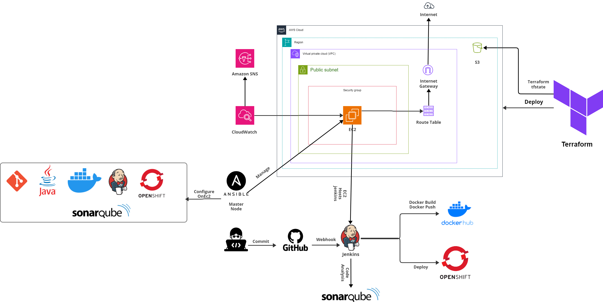
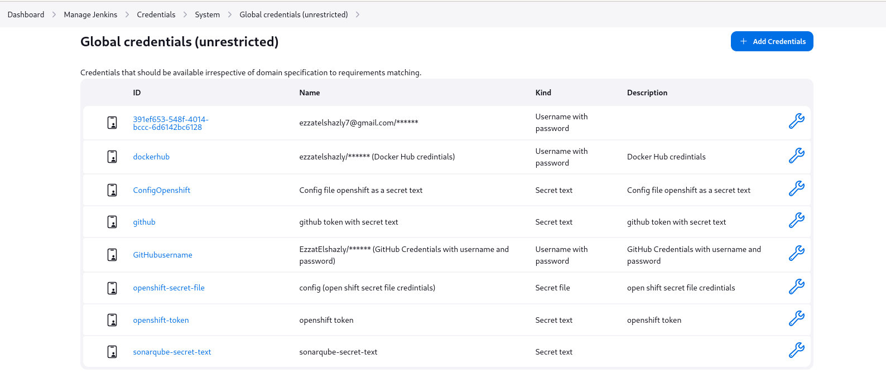
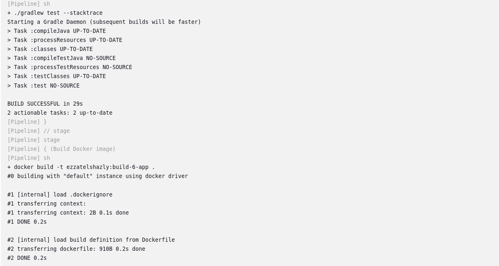
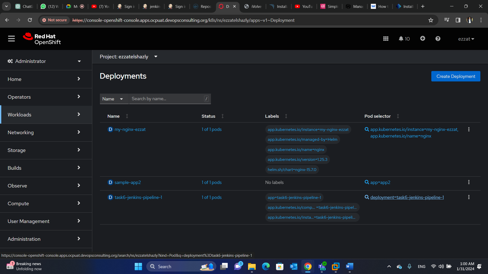
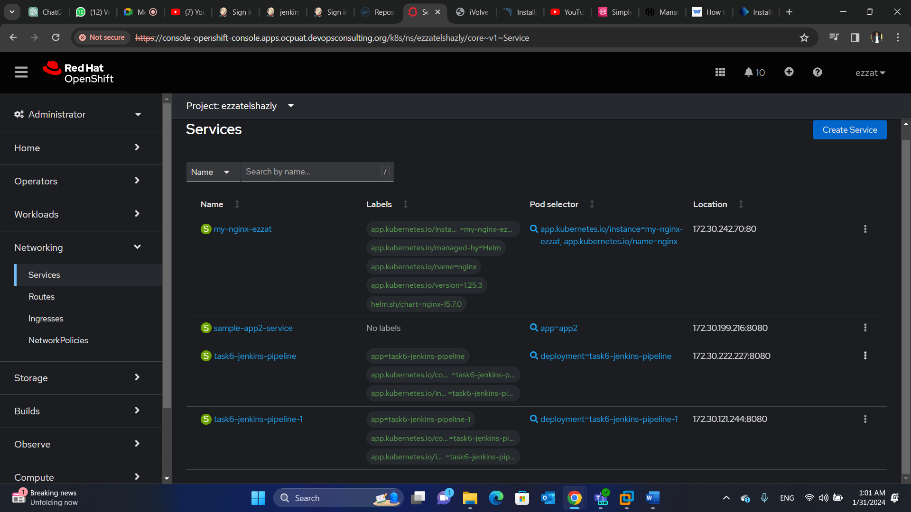
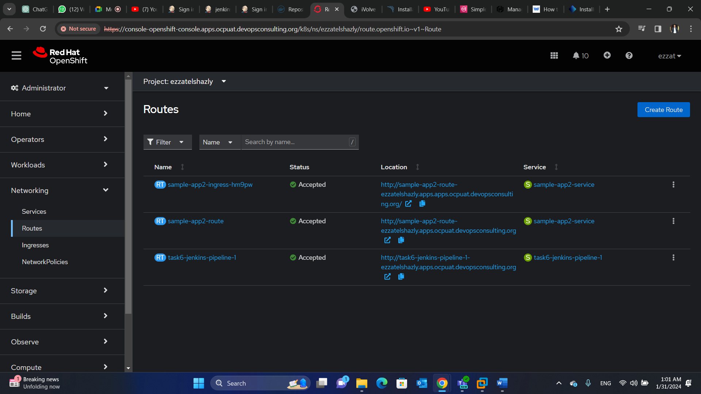

# MultiCloudDevOpsProject
# Project Overview: Automated DevOps Pipeline for a Spring Boot Application

## Introduction

This project aims to establish a fully automated DevOps pipeline for deploying a Spring Boot application. Leveraging a suite of powerful tools including Jenkins, OpenShift, Terraform, Ansible, and Docker, the project embodies the principles of Infrastructure as Code (IaC), Continuous Integration (CI), and Continuous Deployment (CD). The end goal is to achieve streamlined, automated, and efficient deployment processes with robust monitoring and alerting capabilities.

<p align="center">
<br><em>Architecture</em>
</p>


## Requirements
- :white_circle: GitHub
- :white_circle: AWS 
- :white_circle: Terraform
- :white_circle: Ansible
- :white_circle: Docker
- :white_circle: SonarQube
- :white_circle: Openshift cluster


## Project Components

### 1. Spring Boot Application Deployment Using Jenkins on OpenShift

The objective of automating the deployment of a Spring Boot application within an OpenShift cluster is achieved through Jenkins. By developing Jenkins pipelines that efficiently manage the deployment lifecycle from code commit to production deployment, we ensure a scalable and resilient process. 


### 2. AWS Infrastructure Provisioning Using Terraform

Provision and manage a complete AWS infrastructure using Terraform, enabling IaC practices. This approach not only streamlines the creation of AWS resources but also integrates them with CloudWatch for monitoring and alerting.

**Deploying the terraform modules to provision resources:**
* Install AWS CLI and add your AWS user access key and secret access key to enable

```shell
$ curl "https://awscli.amazonaws.com/awscli-exe-linux-x86_64.zip" -o "awscliv2.zip"
$ unzip awscliv2.zip
$ sudo ./aws/install
$ aws configure
```
```
To test,verify and run your terraform code. 
```
```shell
$ terraform init
$ terraform plan
$ terraform apply
```

<p align="center">
<br><em>Terraform structure</em> 
</p>

<p align="center">
<br><em>Terraform apply results</em> 
</p>

### 3. EC2 Instance Configuration Using Ansible
Utilizing Ansible for configuring AWS EC2 instances to host services such as Git, Docker, Java, Jenkins, SonarQube, and OpenShift. This approach ensures consistent and repeatable setups across instances, leading to fully configured and operational EC2 instances ready to support various stages of the DevOps pipeline.
1. Create a key pair on AWS. Download it to be used in the dynamic inventory and change its permissions as follows:
```shell
$ chmod 400 IvolveKey.pem
```
2. Run the ansible playbook using the following command
```shell
$ ansible-playbook -i inventory/aws_ec2.yml playbook.yml
```
<p align="center">
<br><em>Ansible structure</em> 
</p>

<p align="center">
<br><em>Ansible-playbook results on Ec2</em> 
</p>

<p align="center">
<br><em>Ansible-playbook results on local machines</em> 
</p>

<p align="center">
<br><em>Connect to your Ec2</em> 
</p>

```
you can access you sonarqube by writing yourIp:9000
```
> [!NOTE]
> You can not run sonarqube in ec2 t2.micro instance. you need a t2.large.

<p align="center">
<br><em>SonarQube login</em> 
</p>

<p align="center">
<br><em>Create SonarQube project</em> 
</p>

### 4. Centralized Monitoring and Logging with OpenShift
Implemented a centralized monitoring and logging system within the OpenShift cluster as we mentioned in the instructions provided in the reposistory in the instructions folder(Instructions/Instructions-for-setup-for-centralized-loggingTask8.docx). We gain insights into application performance and overall cluster health, thus enhancing operational visibility and intelligence.

### 5. Containerization of the Java Application

Containerizing the Java application is a key part of this project, ensuring environment consistency and ease of deployment. The development of a Dockerfile, detailing all dependencies and configurations, leads to a containerized version of the Java application. 
> [!NOTE]
> Before building the image you need to: chmod +x gradlew
```
To build your image run the following command
```
```shell
$ sudo docker build -t nameOfYourApp:tag .
```
```
To run your image run the following command on a specific port
```
```shell
$ sudo docker run -d -p 8081:8080 (for example) nameOfYourApp:tag 
```
> [!NOTE]
> Note if the port does not run try to add this port in the firewall

```
To check your running containers
```
```shell
$ sudo docker ps
```

<p align="center">
<br><em>Docker build results</em> 
</p>

<p align="center">
<br><em>Accessing Application </em> 
</p>

### 6. CI/CD Automation with Jenkins

Automate the CI/CD process using Jenkins, thereby streamlining the application deployment lifecycle. The development of a Jenkins pipeline script integrates various stages, including code build, testing, and deployment. This results in a seamless, automated pipeline that accelerates the release cycle and reduces manual intervention.

> [!NOTE]
> You need to add your credentials (dockerhub, github, openshift and sonarqube)

<p align="center">
<br><em>Jenkins credentials</em> 
</p>

<p align="center">
<br><em>Success Pipeline</em> 
</p>

<p align="center">
<br><em>Unit Test</em> 
</p>

<p align="center">
<br><em>Jenkins compile Pushing to docker hub</em> 
</p>

<p align="center">
<br><em>Build and Push to docker hub</em> 
</p>

<p align="center">
<br><em>Deploy to openshift and create the resources </em> 
</p>

<p align="center">
<br><em>Deployment in the openshift cluster</em> 
</p>

<p align="center">
<br><em>Service created </em> 
</p>

<p align="center">
<br><em>Route created </em> 
</p>

<p align="center">
<br><em>Accessing the Application using route</em> 
</p>

### 7. Jenkins Shared Library
This repository houses a comprehensive Jenkins Shared Library designed to elevate your Continuous Integration and Continuous Deployment (CI/CD) workflows. By centralizing reusable Groovy scripts, this library aims to simplify pipeline definition, enhance code reusability, and streamline your Jenkins pipeline development.

> [!NOTE]
> Before running your shared library you need some configurations. check on allow default > version to be overridden and include @library changes in job recent changes.

<p align="center">
<br><em>Global Pipeline Libraries</em> 
</p>

> [!NOTE]
> Add your GitHub Repo,credentials and your vars path in the library path 

<p align="center">
<br><em>Global Pipeline Libraries</em> 
</p>

## Conclusion

This project successfully combines various advanced tools to create an efficient and automated system for deploying and managing a Spring Boot application. By using Jenkins for automation, OpenShift for orchestration, Terraform for setting up AWS infrastructure, Ansible for configuration, and Docker for containerization, we've streamlined the entire deployment process. This approach not only makes deploying applications quicker and more reliable but also ensures consistent performance and easy monitoring. The result is a straightforward, effective, and modern solution that meets the demands of today’s fast-paced software development and deployment needs.
